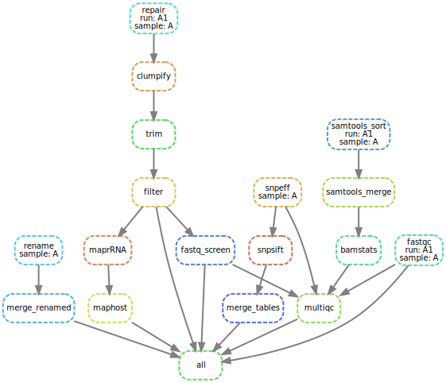

# sarscov2

Snakemake workflow to align PE sequencing reads to NCBI reference sequence NC_045512.2.

## Installing

- Download and install miniconda3: <https://docs.conda.io/en/latest/miniconda.html>.
- Create conda environment and install snakemake.
```bash
conda create -n snakemake-env python=3.7
conda activate snakemake-env
conda install -c bioconda -c conda-forge snakemake
```

- Create a new working directory e.g. `covid-seq` and (Fork +) clone this repository to working directory.
```bash
mkdir covid-seq
cd covid-seq
git clone https://github.com/avilab/sarscov2.git .
```

- Edit `samples.tsv` with full paths to sequencing reads and run names and edit also `config.yaml`.


## Download databases
### Human reference genome
Human genomic sequence database is used to estimate and remove human sequences from analysis.
Run `scripts/download_masked_human_hg19.sh` to download masked human reference genome to filter out reads mapping to the human genome.
Move `hg19_main_mask_ribo_animal_allplant_allfungus.fa.gz` file in your system where you store databases. 
`hg19_main_mask_ribo_animal_allplant_allfungus.fa.gz` file was indexed using `bwa index` command.
Setup environment variable "REF_GENOME_HUMAN_MASKED" pointing to this file or edit "HOST_GENOME" variable in Snakefile.

### Silva small and large subunit ribosomal databases
Silva rRNA database is used to estimate and remove rRNA contamination.
Database files can be downloaded from <https://www.arb-silva.de/fileadmin/silva_databases/release_138/Exports/SILVA_138_SSURef_NR99_tax_silva.fasta.gz> and <https://www.arb-silva.de/fileadmin/silva_databases/release_132/Exports/SILVA_132_LSURef_tax_silva.fasta.gz>
and moved to systems' databases folder.
LSU and SSU fasta files were concatenated and indexed using `bwa index` command.
Setup environment variable "SILVA_DB" pointing to this file or edit "RRNA_DB" variable in Snakefile.


## Running

Test run:
```bash
snakemake --use-conda -n
```

Analyse sequences:
```bash
snakemake --use-conda -j
```

For all possible snakemake command line options please refer to snakemake tutorial <https://snakemake.readthedocs.io/en/stable/executing/cli.html>.


This workflow can be run on a contemporary PC/laptop (e.g. i5/16G) with sufficient HD space to accomodate sequening runs.


## Workflow graph

Workflow graph can be generated:
```bash
snakemake --dag -d test | dot -Tsvg > graph/dag.svg
```


