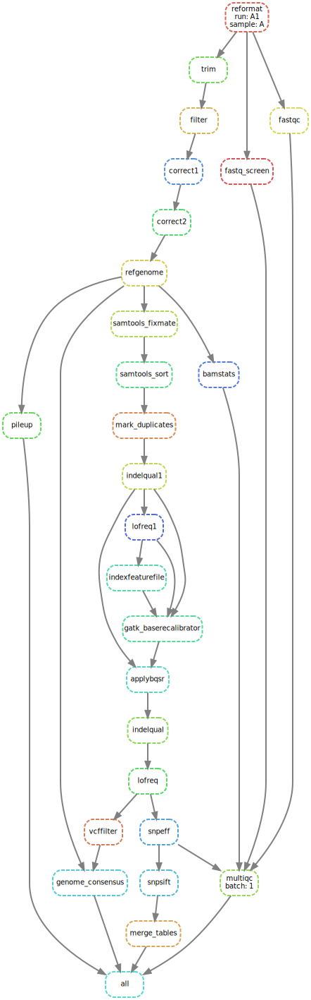

# sarscov2-variation

[](https://snakemake.readthedocs.io)[](https://doi.org/10.5281/zenodo.4515565)

Snakemake workflow to align SARS-CoV-2 paired-end sequencing reads to NCBI reference sequence NC_045512.2.

The workflow preprocesses and maps reads to NC_045512.2 Wuhan seafood market pneumonia virus isolate Wuhan-Hu-1 using Bbmap, calls variations with Lofreq and generates consensus fasta sequences with sites with zero coverage masked.

> This workflow was used to analyse SARS-CoV-2 sequences under [the KoroGeno-EST project](http://www.ctm.ee/et/covid-19/eesti-sars-cov-2-taisgenoomide-jarjestamine-korogeno-est/).

Main outputs:

- results/consensus_masked.fa -- multi FASTA file with generated consensus sequences.
- results/snpsift.csv -- csv file with filtered variant positions that were used to generate consensus sequences.
- results/multiqc.html -- aggregated QC report in html format.

## Installing conda and snakemake

- Download and install miniconda3: <https://docs.conda.io/en/latest/miniconda.html>.
- Follow instructions to install snakemake: <https://snakemake.readthedocs.io/en/stable/getting_started/installation.html>

## Getting workflow

- Create a new working directory e.g. `covidseq` and clone this repository to working directory.

```bash
mkdir covidseq
git clone https://github.com/avilab/sarscov2-variation.git covidseq
cd covidseq
```

## Creating samples table

Sample configuration uses now [portable encapsulated project (PEP) definition](http://pep.databio.org/en/latest/specification/).

- Create/Edit `config/pep.yaml` and `config/samples.csv` files. Please see test directory for examples.

Example of `samples.csv` file with paired reads in two separate files:

batch | sample_name | run | read1 | read2
-----|-----|-----|-----|-----
1 | A  | A1 | A1_R1.fq | A1_R2.fq
1 | A  | A2 | A2_R1.fq | A2_R2.fq
2 | B  | B1 | B1_R1.fq | B1_R2.fq

In case of **interleaved** fastq files, following `samples.tsv` can be used:

batch | sample_name | run | read1
------|-------------|-----|----
1 | A  | A1 | A1.fq
1 | A  | A2 | A2.fq
2 | B  | B1 | B1.fq


- Update `config/pep.yaml`: "read1" (and "read2", "batch") in sources definition matches column(s) in your samples.csv file, if you have other column names, adjust this variable accordingly in `pep.yaml`. Please see [PEP specification](http://pep.databio.org/en/latest/specification/) for further options to customise pep config file to your needs. 


```yaml
pep_version: 2.0.0
sample_table: "samples.csv" OR "samples.tsv"
sample_modifiers:
  append:
    fq1: r1
    fq2: r2
  derive:
    attributes: [fq1, fq2]
    sources:
      r1: "/path/to/reads/{batch}/{read1}"
      r2: "/path/to/reads/{batch}/{read2}"
```

In case of interleaved reads:

```yaml
pep_version: 2.0.0
sample_table: "samples.csv" OR "samples.tsv"
sample_modifiers:
  append:
    fq: r1
  derive:
    attributes: [fq]
    sources:
      r1: "/path/to/reads/{batch}/{read1}"
```


## Download databases

(Optional) Human and rRNA sequence databases for FastQ Screen. In absence of databases fastq screen rule will be skipped.

**Human genomic sequence** database is used to estimate and remove human sequences from analysis.
Run `scripts/download_masked_human_hg19.sh` to download masked human reference genome to filter out reads mapping to the human genome.
Move `hg19_main_mask_ribo_animal_allplant_allfungus.fa.gz` file in your system where you store databases.
`hg19_main_mask_ribo_animal_allplant_allfungus.fa.gz` file was indexed using `bwa index` command.
Setup environment variable "REF_GENOME_HUMAN_MASKED" pointing to this file or edit "HOST_GENOME" variable in Snakefile.

**Silva rRNA database** is used to estimate and remove rRNA contamination.
Database files can be downloaded from <https://www.arb-silva.de/fileadmin/silva_databases/release_138/Exports/SILVA_138_SSURef_NR99_tax_silva.fasta.gz> and <https://www.arb-silva.de/fileadmin/silva_databases/release_132/Exports/SILVA_132_LSURef_tax_silva.fasta.gz>
and moved to systems' databases folder.
LSU and SSU fasta files were concatenated and indexed using `bwa index` command.
Setup environment variable "SILVA_DB" pointing to this file or edit "RRNA_DB" variable in Snakefile.

## Running

Analyse sequences in the **test** folder:

```bash
snakemake --use-conda -d .tests/integration -j 1
```

Dry run:

```bash
snakemake --use-conda -n
```

Analyse sequences:

```bash
snakemake --use-conda -j
```

For all possible snakemake command line options please refer to snakemake tutorial <https://snakemake.readthedocs.io/en/stable/executing/cli.html>.

This workflow can be run on a contemporary PC/laptop (e.g. i5/16G) with sufficient HD space to accomodate sequening runs.

## Workflow graph

Workflow graph can be generated:

```bash
snakemake --dag -d .tests/integration | dot -Tsvg > images/rulegraph.svg
```


