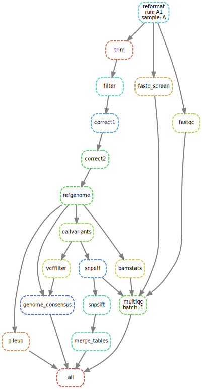

# sarscov2-variation

Snakemake workflow to align SARS-CoV-2 paired-end sequencing reads to NCBI reference sequence NC_045512.2.

The workflow preprocesses and maps reads to NC_045512.2 Wuhan seafood market pneumonia virus isolate Wuhan-Hu-1 using Bbmap, calls variations with Lofreq and generates consensus fasta sequences with sites with zero coverage masked.


> This workflow was used to analyse SARS-CoV-2 sequences under [the KoroGeno-EST project](http://www.ctm.ee/et/covid-19/eesti-sars-cov-2-taisgenoomide-jarjestamine-korogeno-est/).


Main outputs:

- output/consensus_masked.fa -- multi FASTA file with generated consensus sequences.
- output/snpsift.csv -- csv file with filtered variant positions that were used to generate consensus sequences.
- output/multiqc.html -- aggregated QC report in html format. 


## Installing conda and snakemake

- Download and install miniconda3: <https://docs.conda.io/en/latest/miniconda.html>.
- Follow instructions to install snakemake: <https://snakemake.readthedocs.io/en/stable/getting_started/installation.html>


## Clone workflow

- Create a new working directory e.g. `covidseq` and clone this repository to working directory.

```bash
mkdir covidseq
git clone https://github.com/avilab/sarscov2-variation.git covidseq
cd covidseq
```

- Create/Edit `config.yaml` and `samples.tsv` files. Please see test directory for examples. 

Example of `samples.tsv` file with paired reads in two separate files:

sample | run | fq1 | fq2 | platform
-------|-----|-----|-----|--------
A  | A1 | /path/to/A1_R1.fq | /path/to/A1_R2.fq | ILLUMINA
A  | A2 | /path/to/A2_R1.fq | /path/to/A2_R2.fq | ILLUMINA
B  | B1 | /path/to/B1_R1.fq | /path/to/B1_R2.fq | ILLUMINA


In case of **interleaved** fastq files, following `samples.tsv` can be used:

sample | run | fq | platform
-------|-----|----|---------
A  | A1 | /path/to/A1.fq | ILLUMINA
A  | A2 | /path/to/A2.fq | ILLUMINA
B  | B1 | /path/to/B1.fq | ILLUMINA


## Download databases
(Optional) Human and rRNA sequence databases for FastQ Screen. In absence of databases fastq screen rule will be skipped.    

**Human genomic sequence** database is used to estimate and remove human sequences from analysis.
Run `scripts/download_masked_human_hg19.sh` to download masked human reference genome to filter out reads mapping to the human genome.
Move `hg19_main_mask_ribo_animal_allplant_allfungus.fa.gz` file in your system where you store databases. 
`hg19_main_mask_ribo_animal_allplant_allfungus.fa.gz` file was indexed using `bwa index` command.
Setup environment variable "REF_GENOME_HUMAN_MASKED" pointing to this file or edit "HOST_GENOME" variable in Snakefile.    

**Silva rRNA database** is used to estimate and remove rRNA contamination.
Database files can be downloaded from <https://www.arb-silva.de/fileadmin/silva_databases/release_138/Exports/SILVA_138_SSURef_NR99_tax_silva.fasta.gz> and <https://www.arb-silva.de/fileadmin/silva_databases/release_132/Exports/SILVA_132_LSURef_tax_silva.fasta.gz>
and moved to systems' databases folder.
LSU and SSU fasta files were concatenated and indexed using `bwa index` command.
Setup environment variable "SILVA_DB" pointing to this file or edit "RRNA_DB" variable in Snakefile.


## Running

Analyse sequences in the **test** folder:
```bash
snakemake --use-conda -d test -j 1
```

Dry run:
```bash
snakemake --use-conda -n
```

Analyse sequences:
```bash
snakemake --use-conda -j
```

For all possible snakemake command line options please refer to snakemake tutorial <https://snakemake.readthedocs.io/en/stable/executing/cli.html>.


This workflow can be run on a contemporary PC/laptop (e.g. i5/16G) with sufficient HD space to accomodate sequening runs.


## Workflow graph

Workflow graph can be generated:
```bash
snakemake --dag -d test | dot -Tsvg > graph/dag.svg
```


